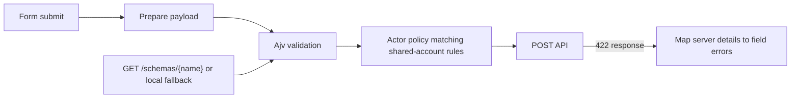

# Client-side validation with Ajv

## Pipeline



## Packages

- `ajv` (Draft 2020-12 via `ajv/dist/2020`)
- `ajv-formats`

## Files

| Path | Role |
|------|------|
| `frontend/src/validation/ajvClient.ts` | compile, cache, validate |
| `frontend/src/validation/localSchemas.ts` | offline / fallback schemas |
| `frontend/src/validation/useSchemaValidation.ts` | React hook |
| `frontend/src/pages/NewChange.tsx` | wired for `change-create` |

## Schema source order

1. `GET /api/schemas/change-create` (FastAPI → Pydantic JSON Schema)  
2. Else `LOCAL_SCHEMAS["change-create"]`

## Run

```bash
cd frontend && npm install && npm run dev
```

Try submitting with empty description or `requester=admin` — Ajv (and actor policy) should block before the network call when possible.
